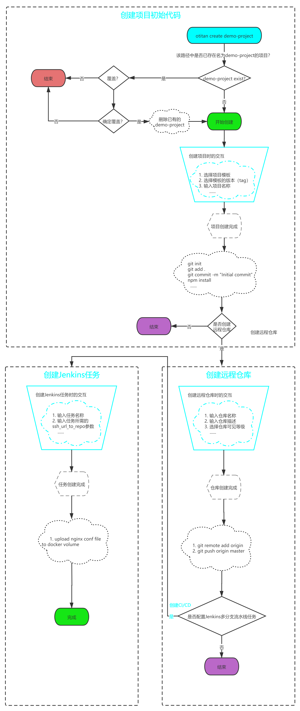

# 介绍

Otitan CLI是一个基于现有的项目模板快速完成新项目启动时所需要做的一些繁琐、重复且易出错的初始工作的脚手架工具。主要包含三部分功能：
- 通过交互式命令可快速输入项目所需的所有初始配置，生成初始代码，并初始化本地Git仓库，自动执行`npm install`。
- 自动在Gitlab中创建远程代码仓库，并推送初始项目代码至仓库中，同时配置好Jenkins所需要的Webhook参数。
- 自动创建Jenkins多分支流水线任务，并上传初始项目的Nginx配置至服务器所需要的位置，使测试环境的服务可以直接访问。

## 该工具的运行流程图

